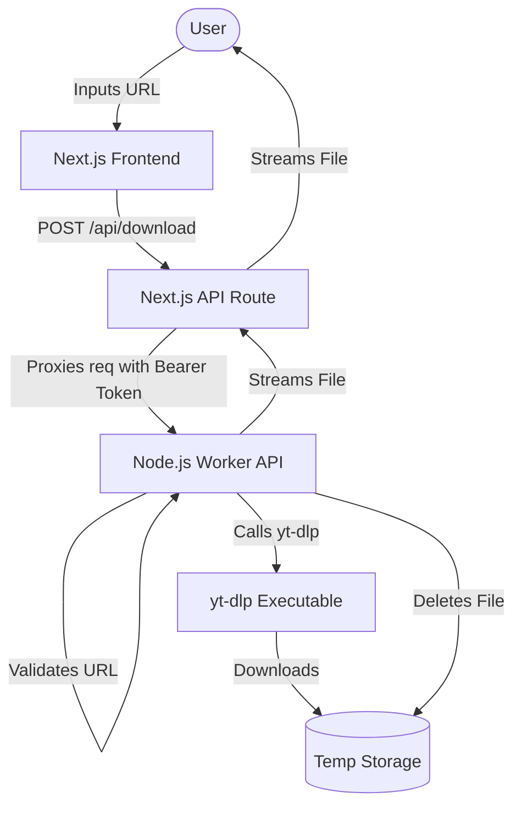

# REELDROP

Public Reels. Simple Downloads.

## 1. What the project does

ReelDrop is a web application that allows users to download public Instagram Reels easily. It consists of a Next.js frontend and a Node.js worker that utilizes `yt-dlp` to extract media streams. 

The architecture is designed to hide the worker behind the frontend and rate-limit requests to protect infrastructure.

## 2. Architecture diagram



## 3. Requirements

- Node.js 18+
- Docker & Docker Compose (for production worker)
- FFmpeg (installed automatically in Worker Docker)
- Python 3 (installed automatically in Worker Docker for yt-dlp)

## 4. Local installation

Clone the repo, then install frontend and worker dependencies:

```bash
# Frontend
npm install

# Worker
cd worker
npm install
```

## 5. Environment variables

Copy the example environment files and configure them.

**Frontend (`.env`):**
```
WORKER_URL=http://localhost:8080/api/download
WORKER_SECRET=super_secret_token
```

**Worker (`worker/.env`):**
```
PORT=8080
WORKER_SECRET=super_secret_token
MOCK_MEDIA_PROVIDER=true # Set to false to use real yt-dlp
```

## 6. How to run frontend

From the root directory:

```bash
npm run dev
```

The frontend will be available at http://localhost:3000.

## 7. How to run worker

From the `worker` directory:

```bash
cd worker
npm run dev
```

The worker will be available at http://localhost:8080.

## 8. How to run Docker

You can run the worker using Docker Compose from the root directory:

```bash
docker-compose up --build -d
```

## 9. How to test

To test the application locally without sending actual requests to Instagram, ensure `MOCK_MEDIA_PROVIDER=true` in the worker environment.
Run both the frontend and worker, then navigate to http://localhost:3000 and enter a valid Instagram URL (e.g., `https://www.instagram.com/reel/123456789/`).

## 10. How to deploy

See `DEPLOYMENT.md` for detailed instructions.

## 11. Security notes

- **Authentication:** The worker is protected by a `WORKER_SECRET`. The frontend sends this secret in the `Authorization` header. Do NOT expose the worker directly to the public without this.
- **SSRF Protection:** The worker strictly validates URLs to ensure they belong to `instagram.com` and match expected paths (`/reel/`, `/p/`, `/tv/`).
- **Rate Limiting:** The worker implements IP-based rate limiting to prevent abuse.

## 12. Troubleshooting

- **Downloads failing:** Ensure Instagram hasn't blocked the worker IP. Try updating `yt-dlp-exec`.
- **Worker Unauthorized:** Ensure `WORKER_SECRET` matches exactly between frontend `.env` and worker `.env`.

## 13. Media provider limitations

**IMPORTANT INSTAGRAM LIMITATIONS**
Do not promise that every Instagram Reel will always download.
Instagram frequently changes:
- media URLs
- page structure
- anti-bot systems
- access requirements

The UI gracefully handles extraction failures. The architecture allows replacing `yt-dlp` with another provider (e.g., a commercial API) later via the `MediaProvider` interface.

**Note:** We do not implement methods intended to bypass authentication or access controls.

## 14. Privacy/copyright notes

ReelDrop is intended for public content only. We do not store downloaded videos; they are processed temporarily in memory/disk and immediately deleted. Users are responsible for complying with copyright laws and Instagram's terms of service.
